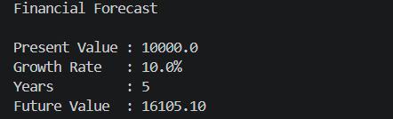

# Exercise 7 - Financial Forecasting

## Objective

Implement a recursive algorithm to predict future financial values based on annual growth rates.

---

## Scenario

Develop a financial forecasting tool that calculates the future value of an investment using recursion.

---

## Algorithm Used

Recursive Algorithm

---

## Formula

Future Value = Present Value × (1 + Growth Rate)^Years

---

## Time Complexity

- Time Complexity: **O(n)**
- Space Complexity: **O(n)**

---

## Optimization

An iterative solution can reduce the space complexity to **O(1)** because it avoids recursive function calls.

---

## Output

