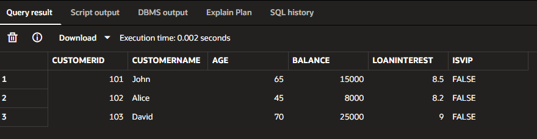
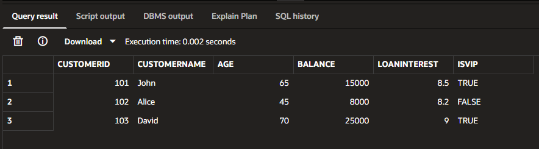
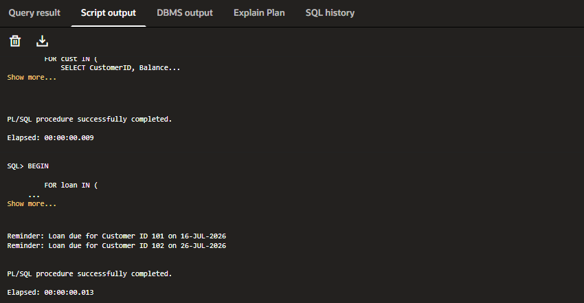

# Exercise 1 - Control Structures (PL/SQL)

## Objective

Implement PL/SQL control structures such as loops and conditional statements to solve banking-related scenarios.

---

## Scenarios

### Scenario 1

Apply a 1% discount to loan interest rates for customers above 60 years of age.

### Scenario 2

Promote customers with a balance greater than $10,000 to VIP status.

### Scenario 3

Print reminder messages for customers whose loans are due within the next 30 days.

---

## Concepts Used

- PL/SQL Blocks
- FOR LOOP
- IF Statement
- UPDATE Statement
- COMMIT
- DBMS_OUTPUT.PUT_LINE
- SYSDATE

---

## Time Complexity

- Scenario 1 : O(n)
- Scenario 2 : O(n)
- Scenario 3 : O(n)

---

## Output
### Scenario 1

### Scenario 2

### Scenario 3
