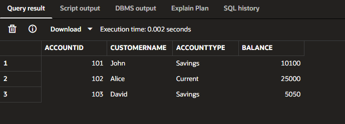
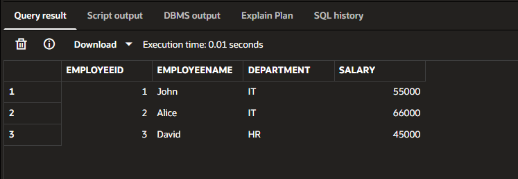
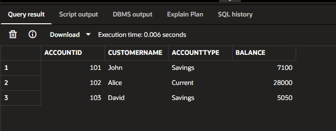

# Exercise 2 - Stored Procedures

## Objective

Implement PL/SQL stored procedures to automate banking operations.

## Scenarios

1. Process Monthly Interest
2. Update Employee Bonus
3. Transfer Funds

## Concepts Used

- Stored Procedures
- Input Parameters
- Variables
- IF Statements
- UPDATE
- COMMIT
- DBMS_OUTPUT
- SELECT INTO

## Time Complexity

- Process Monthly Interest: O(n)
- Update Employee Bonus: O(n)
- Transfer Funds: O(1)

## Output

### Scenario 1

### Scenario 2

### Scenario 3

